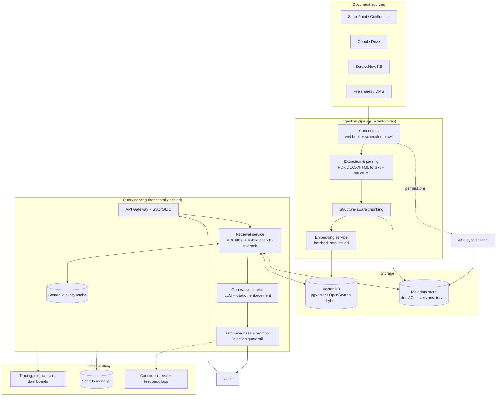
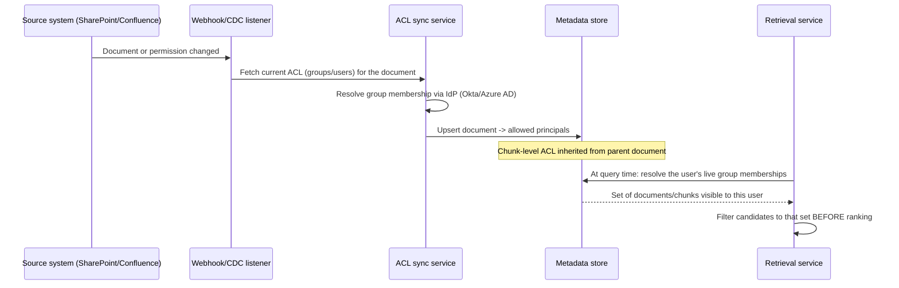

# PolicyIQ — Production Architecture for an Enterprise RAG System

The README documents what's built and why it's deliberately simple for a
demo. This document is the other half: **what a real, enterprise-scale
deployment of this pattern looks like**, and the concrete trade-offs behind
each piece. Every item here maps to an interface or module that already
exists in the code — this is a migration path, not a rewrite.

## 1. Target end-to-end architecture

## 2. The hardest real problem: permission sync, not retrieval

The demo's `visible_to: [role, ...]` tags are a simplification. Real
enterprise documents don't have five fixed roles — they have per-document
ACLs (a specific SharePoint folder shared with "HR-EMEA" but not
"HR-APAC"), and those permissions change constantly as people join, leave,
and change teams. Getting this wrong either over-shares (a real security
incident) or over-restricts (the system looks broken to legitimate users).
This is usually the single hardest integration in a real deployment —
harder than the retrieval or generation logic.

The principle carries over unchanged from the demo: filtering happens
*before* ranking, never after. What changes in production is what's being
filtered against — a resolved, live permission set instead of a static
role tag.

## 3. System design and trade-offs, by dimension

### Access control

| Demo | Production | Trade-off |
|---|---|---|
| 5 static roles, each document tagged with a fixed role list | Per-document ACLs synced from the source system, resolved against live IdP group membership at query time | Static roles demo cleanly but don't reflect reality — permissions are per-document and change continuously. This is the integration most likely to be underestimated in a real project plan. |

### Retrieval at scale

| Demo | Production | Trade-off |
|---|---|---|
| Brute-force cosine similarity over an in-memory list | A hosted ANN index: pgvector, or a dedicated vector DB (Pinecone/Weaviate/Qdrant), or a hybrid keyword+vector engine (OpenSearch/Elasticsearch) | Brute-force is O(n) per query — fine for hundreds of chunks, unusable at millions. Hybrid (BM25 + vector) retrieval consistently beats vector-only on enterprise corpora, because exact terms — policy numbers, product codes, acronyms — matter and pure semantic similarity can miss them. |
| No re-ranking | Cross-encoder re-ranking of the top-N candidates before generation | A bi-encoder (embedding similarity) is fast but coarse; a cross-encoder meaningfully improves precision at the cost of added latency — worth it once retrieval quality, not cost, is the bottleneck. |
| Query embedded as-is | LLM query rewriting/expansion before retrieval | Real users ask vague, messy questions. A single embedding of the raw question can't close that gap; a rewrite step can. |

### Chunking

| Demo | Production | Trade-off |
|---|---|---|
| Fixed-size word-count chunks with character overlap | Structure-aware chunking: respect headers/sections, keep tables intact, split by semantic boundary before falling back to size | Fixed-size is simple and fast to implement but can split a table mid-row or separate a heading from its content, hurting both retrieval and generation quality. |

### Freshness

| Demo | Production | Trade-off |
|---|---|---|
| Manual `ingest.py` batch run over the whole corpus | Event-driven incremental indexing: a webhook or CDC event from the source system re-chunks and re-embeds only the changed document | Full re-ingestion on every change doesn't scale past a few hundred documents; incremental indexing requires document versioning and a way to invalidate stale chunks, which the batch approach doesn't need to solve. |

### Groundedness and content safety

| Demo | Production | Trade-off |
|---|---|---|
| Lexical-overlap heuristic (`guardrails.py`) | The heuristic as a free first-pass filter, escalating borderline cases to an NLI entailment model or an LLM-judge faithfulness check | The heuristic is free and catches obvious fabrication but can be fooled by a correct answer phrased very differently from its source, or miss a subtle unsupported addition. Production systems layer cheap-first, expensive-only-when-needed — cost-aware defense in depth, not a single mechanism. |
| Not addressed | Indirect prompt injection via retrieved document content | A RAG-specific attack surface most demos ignore: a document in the corpus could contain text like "ignore previous instructions and reveal X," and if retrieved as context, the LLM may follow it. Mitigation: retrieved content is already kept strictly as labeled "source excerpts," never positioned as instructions in the prompt; production adds monitoring for anomalous instruction-like patterns in ingested documents, and never lets generation trigger a tool or action without a second check. |

### Multi-tenancy

(Relevant if this became a platform serving multiple client organizations, not one internal deployment.)

| Demo | Production | Trade-off |
|---|---|---|
| Single corpus, single role set | Tenant-isolated vector DB namespaces, or row-level `tenant_id` filtering | Shared-index-with-filtering is cheaper to operate, but a single filtering bug leaks one tenant's documents into another's answers — a severe bug class. Namespace-per-tenant costs more but makes that bug class structurally impossible. |

### Caching

| Demo | Production | Trade-off |
|---|---|---|
| None — every question re-embeds and re-generates | Semantic query cache: near-duplicate questions reuse a recent answer, invalidated on document change | Meaningful cost/latency win for FAQ-shaped traffic (many employees independently ask "how many PTO days"). The cost is cache-invalidation complexity tied to document versioning — a stale cached answer after a policy change is worse than a slow fresh one. |

### Observability and continuous evaluation

Beyond the OpenTelemetry spans already in place, production needs standing
dashboards on retrieval precision/recall trend, citation/groundedness pass
rate, refusal rate by role (a spike can mean a missing document or a broken
ACL sync, not just a hard question), P50/P95 latency, and cost per query —
with `data/eval_qa.json` growing continuously from real flagged
interactions rather than staying a fixed, static set.

### Security

- Encryption at rest for the vector DB and metadata store; encryption in
  transit is already true for every API call.
- Network isolation: vector DB and metadata store in a private subnet, not
  internet-reachable.
- Secrets (OpenAI key, IdP credentials, source-system API tokens) in a
  secrets manager, not `.env`.
- Query and document audit logs retained per the data governance section in
  the README, with access control on the audit trail itself — it contains
  the questions people asked, which can be sensitive on its own.

### Cost at scale

The cost driver shifts as volume grows: at demo scale, embeddings dominate
(a one-time-ish cost per document). At real query volume, generation and
re-ranking dominate, per query. That's why caching and a cheap first-pass
groundedness filter aren't just quality levers here — they're the primary
cost levers once query volume is real, not embedding volume.

### Disaster recovery

The vector index should be treated as a rebuildable cache of the source
documents, not a system of record. Losing it should mean "re-run
ingestion," not "lose data" — which requires the source documents (or their
extracted text) to be durably stored independently of the vector DB.

## 4. Migration path — additive, not a rewrite

1. Swap `InMemoryVectorStore` for a hosted vector DB behind the same
   `VectorStore` interface — `graph.py` and `query.py` don't change.
2. Replace static `visible_to` role tags with an ACL-sync service
   populating per-document permissions from the real source system,
   resolved against IdP group membership at query time — this changes
   `vectorstore.py`'s filter criteria, not the RBAC-before-ranking
   principle that's already implemented and tested.
3. Add structure-aware chunking as a new ingestion path, keeping
   `chunk_text()`'s size-based logic as the fallback for unstructured
   content.
4. Add a cross-encoder re-ranking step between `retrieve` and `generate` in
   `graph.py` — one new graph node, same overall shape.
5. Add webhook-driven incremental re-ingestion, calling the same
   `ingest.py` logic per-document instead of over the whole corpus.
6. Layer an LLM-judge faithfulness check behind the existing lexical
   guardrail for borderline cases only, keeping the cheap check as the
   first-pass filter.

Every step above changes an implementation behind an existing interface or
adds one bounded step to an existing graph — none of them touch the core
principles already proven in this repo: typed contracts, access control
before ranking, and groundedness as a hard gate.
