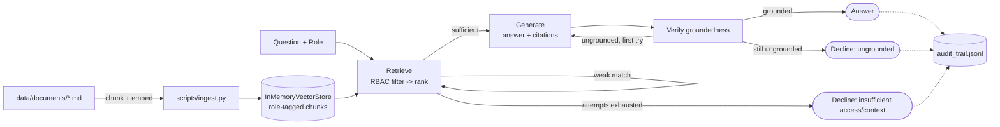
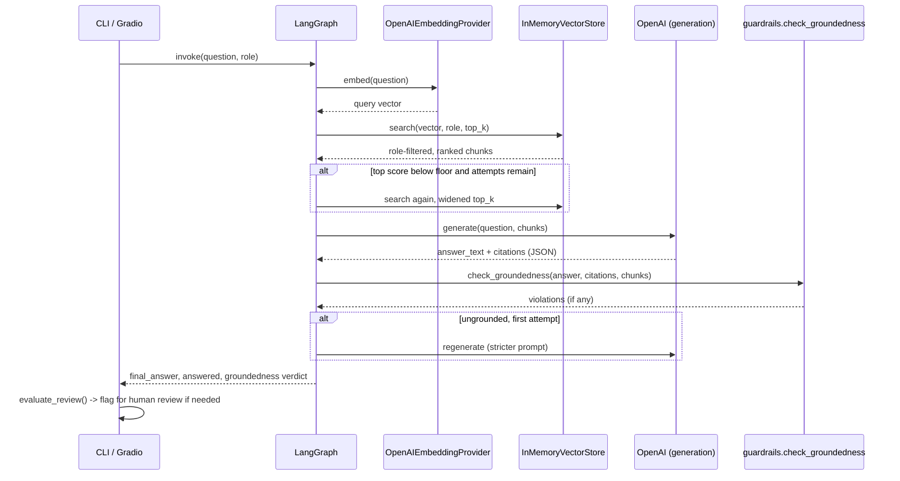

# PolicyIQ

This repository serves as a sanitized, production-ready reference architecture built to demonstrate enterprise agentic patterns. 
It mirrors the architectural designs, multi-agent state machines, and evaluation frameworks I deploy in enterprise environments, stripped of proprietary data and corporate logic.

An access-controlled, citation-grounded RAG system over enterprise policy
documents. Ask a question as a given role (employee, HR, IT, Legal,
Finance) and get an answer that's retrieved only from documents that role
is authorized to see, generated only from what was actually retrieved, and
verified against those sources before being trusted — or a clear refusal
when the corpus doesn't support a confident answer.

This is the third project in a small portfolio of reference architectures
([ClaimSight](https://github.com/eaisoa2ai/insurance-claim-triage-ai),
[OutreachIQ](https://github.com/eaisoa2ai/outreach-iq)) that each prove a
different orchestration pattern. The first two are typed multi-agent
pipelines (a DAG with an escalation router, and a sequential crew). This one
is deliberately different: a **corrective retrieval loop** — the pattern
LangGraph's cyclic-graph support exists for — plus the retrieval-specific
concerns neither of the other two touch: chunking, embeddings, access
control at the retrieval layer, and citation-grounded generation.

See [ARCHITECTURE.md](ARCHITECTURE.md) for the end-to-end production design
this demo is a scaled-down proof of: the real permission-sync problem (per-
document ACLs, not five static roles), hybrid retrieval and re-ranking at
scale, incremental indexing, prompt-injection-via-retrieved-content, multi-
tenancy, and a concrete migration path from this repo to that architecture.

## Why this design

**Retrieval-first, not generation-first.** The standard failure mode of a
naive "stuff some context into a prompt and hope" RAG demo is that a
plausible-sounding answer isn't checked against what was actually
retrieved. Here, groundedness is a hard gate, not a hope: `guardrails.py`
checks every citation actually points at a retrieved chunk, and that the
answer's own vocabulary substantially overlaps with what it cites. Fail
that check, and the system tries once more with a stricter prompt, then
declines rather than guesses.

**Access control at the retrieval layer, not the display layer.** A
document a role isn't permitted to see is filtered out of the candidate set
*before* similarity ranking happens (`vectorstore.py`) — it's never
eligible to be the "best match," let alone leak into a generated answer.
`tests/test_vectorstore.py::test_rbac_filter_excludes_even_a_perfect_score_match`
verifies this directly: a restricted chunk with a perfect vector-similarity
score still never surfaces for an unauthorized role.

**A correction loop, not a single retrieval shot.** If the top retrieved
chunk's similarity score doesn't clear a floor, the graph widens the search
and retries (up to a bounded number of attempts) before declining — a
question that's simply outside the corpus, or outside what a role can see,
gets a specific "insufficient access/context" answer rather than a
low-confidence guess dressed up as a real one.

## Architecture



### One query, step by step



## The corrective loop, and why it's bounded the way it is

| Stage | What triggers a retry | What triggers a decline |
|---|---|---|
| Retrieval | Top chunk's similarity score below `min_relevance_score` | Still below floor after `max_retrieval_attempts` (default 2) — declines as "insufficient access or context" |
| Generation | Groundedness check fails on the first attempt | Still ungrounded after one stricter regeneration — declines as "found related info, couldn't confidently ground an answer" |

Both loops are bounded by a fixed attempt count, not an LLM deciding when to
stop — an unbounded agentic retry loop against a real API is a real cost
and latency risk; the bound is a config value in `config/settings.yaml`,
not a hardcoded number in the graph.

## What's deliberately simple, and why

| Decision | Alternative considered | Why |
|---|---|---|
| Flat, brute-force cosine similarity over an in-memory, disk-persisted store | A hosted vector DB (pgvector, Pinecone, LanceDB) | Right-sized for a demo corpus (a few hundred chunks) — the exact same trade-off as outreach-iq's SQLite choice. Swapping `InMemoryVectorStore` for a hosted store is a class implementing the same `VectorStore` interface; nothing above it changes. |
| Retrieval "grading" is a similarity-score threshold, not an LLM call | An LLM grades each chunk's relevance (classic Self-RAG/Corrective-RAG) | Deterministic, free, and instantly testable; the natural upgrade at real scale is an LLM or cross-encoder grader, noted below. |
| Groundedness checked by lexical overlap, not an LLM self-critique | Ask the LLM "are you sure this is grounded?" | Same principle as outreach-iq's guardrails: a check that doesn't depend on the same model that might be wrong being asked to grade itself. |
| No cross-encoder re-ranking | Re-rank top-N with a cross-encoder before generation | Real quality lever at larger corpora than a demo needs; documented here rather than hidden. |
| Query embedded once per attempt, not reformulated by an LLM | LLM rewrites the query before retrying | Keeps the retry loop free and instant; query reformulation is the natural next upgrade if widening top_k isn't enough in practice. |

## Observability and audit

Every retrieval, generation, and groundedness check is a real OpenTelemetry
span (`rag.retrieve`, `rag.generate`, `rag.verify_groundedness`,
`policyiq.query`) — console exporter by default, one env var
(`OTEL_EXPORTER_OTLP_ENDPOINT`) to ship to a real collector, identical
pattern to outreach-iq. Every query additionally writes one audit entry to
`logs/audit_trail.jsonl` with the review decision and reasons — the audit
trail answers *what was decided and why* for a compliance reviewer; tracing
answers *how long it took and where it failed* for debugging the system.

## Data governance

- **Role-based retrieval, not role-based display.** Covered above — this is
  the actual access-control mechanism, not a UI-layer filter.
- **No real company data.** Every document in `data/documents/` describes a
  fictitious company ("Northwind Group") and was written for this project.
- **Query logs contain the question text.** In production, questions asked
  by role could themselves be sensitive (an employee asking about
  disciplinary procedures). The audit trail should have a defined retention
  window and access control of its own — not included here, same "demo
  intentionally leaves this out" honesty as the other two projects.

## Project layout

```
policy-iq/
├── main.py                    # CLI: ask one question as one role
├── config/settings.yaml       # thresholds: relevance floor, retry limits, chunk size
├── src/policyiq/
│   ├── config.py               # pydantic-settings: .env + settings.yaml
│   ├── models.py               # every typed contract (AgentOutput base, Role, chunks, results)
│   ├── ingestion.py             # frontmatter parsing + chunking
│   ├── embeddings.py            # EmbeddingProvider interface + OpenAI implementation
│   ├── vectorstore.py           # VectorStore interface + InMemoryVectorStore (RBAC + ranking)
│   ├── guardrails.py            # groundedness checks (pure functions)
│   ├── review.py                # pure human-review routing logic
│   ├── audit.py                 # append-only JSONL audit trail
│   ├── observability.py         # OpenTelemetry tracer setup
│   ├── query.py                 # answer_question(): orchestrate + route + audit
│   └── agent/
│       ├── graph.py             # the LangGraph corrective-retrieval loop
│       ├── llm.py               # generation call + JSON parsing into AnswerDraft
│       └── prompts.py
├── ui/app.py                   # Gradio dashboard: role switch, chat, sources, groundedness
├── scripts/
│   ├── ingest.py                 # chunk + embed + persist the vector store
│   └── run_evals.py              # labeled Q&A eval (retrieval, groundedness, refusal accuracy)
├── data/
│   ├── documents/                # 10 synthetic policy documents, role-tagged
│   └── eval_qa.json               # labeled eval set
└── tests/                        # ingestion, vectorstore/RBAC, guardrails, review, models, config
```

## Running it

Requires Python 3.11+ and an OpenAI API key — unlike outreach-iq's
mock-first providers, there's no meaningful offline mode here: retrieval
quality *is* what's being demonstrated, and a fake embedding would prove
nothing. Cost is trivial at this corpus size (ingesting all 10 documents
costs a fraction of a cent in embedding tokens).

```bash
# with uv
uv sync --extra dev
cp .env.example .env             # add your OPENAI_API_KEY
uv run python scripts/ingest.py  # chunk, embed, and persist the 10 sample documents
uv run python main.py --question "How many PTO days do I accrue per year?" --role employee
uv run python ui/app.py          # Gradio dashboard at http://localhost:7860
uv run pytest                    # unit tests: no API key needed, no LLM calls

# with plain venv + pip
python -m venv .venv && source .venv/Scripts/activate   # Windows: .venv\Scripts\activate
pip install -e ".[dev]"
cp .env.example .env
python scripts/ingest.py
python main.py --question "What is the Tier 1 incident containment SLA?" --role it
python ui/app.py
pytest
```

Try the same question as different roles to see access control in action —
e.g., "What is the gift value limit for a business partner?" answers for
`legal` and is declined for `employee`, because `anti_corruption_policy.md`
is tagged `visible_to: [legal]` only.

To see retrieval accuracy, groundedness, and refusal-correctness measured
against the labeled eval set (after ingesting):

```bash
uv run python scripts/run_evals.py
```

This is deliberately **not** part of the pytest suite CI runs on every
push — it needs real embeddings and LLM calls, so it costs a small amount
and isn't bit-for-bit deterministic. `tests/` covers everything that can be
tested as pure functions (chunking, RBAC filtering, groundedness heuristics,
review logic) with zero API calls.

## Stack

| Layer | Tool |
|---|---|
| Orchestration | LangGraph (`StateGraph`, cyclic corrective-retrieval loop) |
| Structured data | Pydantic v2 |
| Embeddings + generation | OpenAI (`text-embedding-3-small`, `gpt-4o-mini`) |
| Vector search | In-memory cosine similarity (NumPy), JSON-persisted |
| Tracing | OpenTelemetry |
| UI | Gradio |
| Testing | pytest |

## License

MIT — see [LICENSE](LICENSE).
